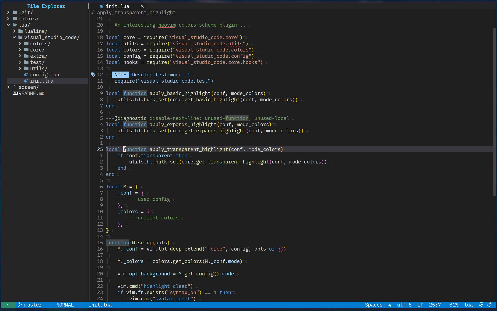
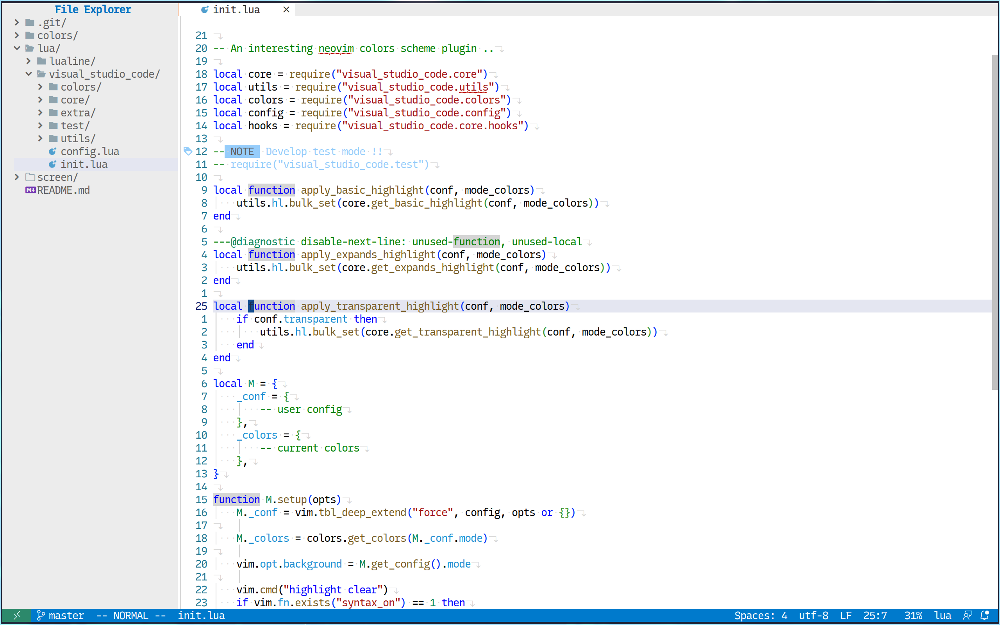

# VISUAL_STUDIO_CODE

## Overview

A `neovim` theme based on `visual studio`, written in `Lua`.

It tries to get all the colors in `developer mode` of `vscode`, so the simulation is very high.

<h3 align="center">


</h3>

## Install and use

Install via `Lazy`:

```lua
-- lazy
{
    "askfiy/visual_studio_code"
    priority = 100,
    config = function()
        require("visual_studio_code").setup({
            mode = "dark",
        })
    end,
}
```

Install via `Packer`:

```lua
-- packer
{
    "askfiy/visual_studio_code",
    config = function()
        require("visual_studio_code").setup({
            mode = "dark",
        })
    end,
}
```

## Default configuration

Default config:

```lua
local default_config = {
    -- `dark` or `light`
    mode = "dark",
    -- Whether to load all color schemes
    preset = true,
    -- Whether to enable background transparency
    transparent = false,
    -- Whether to apply the adapted plugin
    expands = {
        hop = true,
        lazy = true,
        aerial = true,
        fidget = true,
        null_ls = true,
        nvim_cmp = true,
        gitsigns = true,
        which_key = true,
        nvim_tree = true,
        lspconfig = true,
        telescope = true,
        bufferline = true,
        nvim_navic = true,
        nvim_notify = true,
        vim_illuminate = true,
        nvim_treesitter = true,
        nvim_ts_rainbow = true,
        nvim_scrollview = true,
        indent_blankline = true,
        vim_visual_multi = true,
    },
    hooks = {
        before = function(conf, colors, utils) end,
        after = function(conf, colors, utils) end,
    },
}
```

## Related functions

The plugin provides some utility functions:

```lua
require("visual_studio_code")
   - get_config()               -- current configuration table
   - get_colors()               -- current color highlight table
   - get_lualine_sections()     -- lualine sections table

require("visual_studio_code.utils")
   - hl.set(name, options)
   - hl.link(src, dst)
   - hl.get(name, option)
   - hl.bulk_set(groups)
```

Example:

```lua
require("visual_studio_code.utils").hl.set("Normal", { fg = "#000000", bg = "#1E1E2E"})

require("visual_studio_code.utils").hl.link("NormalFloat", "Normal")

require("visual_studio_code.utils").hl.get("Normal", "fg")   -- #000000

require("visual_studio_code.utils").hl.bulk_set({
    Normal = { fg = "#000000", bg = "#1E1E2E"},
    NormalFloat = { link = "Normal" },
    Cursor = { bg = "#0FE1EE", bold = true }
})
```

## Hooks function

The plugin provides 2 hook functions, which are automatically executed before and after the color is applied:

```lua
hooks = {
    before = function(conf, colors, utils) end,
    after = function(conf, colors, utils) end,
}
```

## Lualine integrated

To quickly get a `vscode` style statusline, you need to use `lualine`:

```lua
require("lualine").setup({
    options = {
        theme = "auto",
        icons_enabled = true,
        component_separators = { left = "", right = "" },
        section_separators = { left = "", right = "" },
        disabled_filetypes = {},
        globalstatus = true,
        refresh = {
            statusline = 100,
            tabline = 100,
            winbar = 100,
        },
    },
    sections = require("visual_studio_code").get_lualine_sections(),
})
```

## Extension

Extended plugin colors are in the `expands` directory.

[lua/visual_studio_code/core/expands/](./lua/visual_studio_code/core/expands/)

Also, any new `PR`s are welcome, as I'm not enthusiastic about plugin adaptation, so may need everyone's help to make it better..

## Additional considerations

Regarding the `bufferline`, you need to make sure it has the `themable` option turned on:

```lua

require("bufferline").setup({
    options = {
        themable = true,
        ...
    }
})
```

If you need to use the `vim_visual_multi` plugin adaptation, please add the following code to your `init.lua` file:

```lua
vim.g.VM_Extend_hl = "VM_Extend_hl"
vim.g.VM_Cursor_hl = "VM_Cursor_hl"
vim.g.VM_Mono_hl = "VM_Mono_hl"
vim.g.VM_Insert_hl = "VM_Insert_hl"
```

If you don't use `tmux`, try running `:set cmdheight=0`.

If some `nvim-web-devicons` icons do not display well in `light` mode, please tell me the name of the icon, and I will adapt it.
